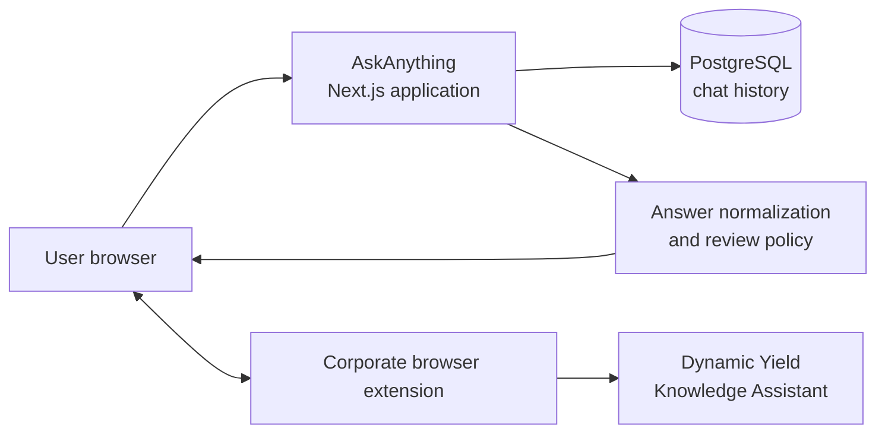

# How AskAnything Works

## 1. Purpose

AskAnything is an internal application that helps Dynamic Yield Solutions
Engineering teams answer product questions and complete RFP/RFI questionnaires.
It provides two main workflows:

- **Chat:** ask individual questions and keep a searchable conversation history.
- **Bulk import:** load an Excel or CSV questionnaire, generate answers
  sequentially, review exceptions, and export the completed workbook.

The application uses the Dynamic Yield Knowledge Assistant (KA) as its knowledge
and answer-generation backend. AskAnything adds workflow management, answer
formatting, quality controls, diagnostics, and Excel handling around that service.

## 2. High-Level Architecture



The application is built with Next.js, React, TypeScript, Tailwind CSS, Prisma,
and PostgreSQL. It can run locally or as a hosted Vercel application.

### Localhost

When AskAnything runs on `localhost`, its server calls Knowledge Assistant
directly. The browser extension is not used for this route.

### Hosted application

The hosted Vercel environment cannot reliably reach the corporate KA endpoint.
Instead, the browser extension sends the KA request from the user's machine,
where corporate DNS and VPN access are available. The raw KA response is then
sent to AskAnything for normalization and display.

This means that, in the hosted workflow:

1. The question and selected answer instructions are sent from the web page to
   the extension.
2. The extension calls Knowledge Assistant.
3. The raw response returns to the web page.
4. The web page sends the question, context, and raw response to AskAnything's
   `/api/ask` or `/api/chat` endpoint.
5. AskAnything applies output policy, extracts review notes, and returns the
   final customer-facing answer.

## 3. Chat Workflow

Chat is intended for individual product and technical questions.

1. Create or select a conversation.
2. Select an answer style.
3. Enter a question.
4. AskAnything sends one generation request to Knowledge Assistant.
5. The response is normalized before it is shown.
6. The conversation, status, and tags are stored in PostgreSQL.

The available answer styles are:

| Style | Intended output |
|---|---|
| Detailed | Direct opening followed by developed explanatory paragraphs |
| Loopio (RFP) | Vendor-facing RFP response with themed sections, bullets, and an example |
| Simple | Short plain-prose answer |
| Custom | Uses an uploaded Markdown instruction file |

## 4. Bulk Import Workflow

Bulk import is designed for spreadsheets containing many questionnaire items.
It supports `.xlsx`, `.xls`, `.csv`, and `.ods` files.

### Step 1: Load and map the workbook

After a file is selected, AskAnything detects:

- the worksheet;
- the header row;
- the question or requirement column;
- the answer column;
- the Needs Review column.

The user can adjust the mapping before processing. Section headings are excluded
from generation so that only actual questions or requirements become Batch rows.
Rows that already contain answers are skipped by default.

### Step 2: Add shared context

The optional company or industry context is applied to every question. This can
include customer background, implementation assumptions, scope, or terminology.

### Step 3: Generate answers

Questions are processed sequentially. AskAnything deliberately permits only one
active KA request at a time to reduce rate-limit pressure and avoid duplicate
generations.

For each row:

1. AskAnything builds the question and answer-style instructions.
2. The request is sent directly or through the Corporate Bridge.
3. KA returns one raw answer.
4. `/api/ask` normalizes the answer.
5. The customer-facing response is written to **Answer**.
6. Uncertainty, unsupported details, or quality issues are written to
   **Needs Review**.

There is no automatic second generation to rewrite a poor answer. A network
failure with an uncertain outcome pauses the Batch instead of silently
resubmitting and potentially creating a duplicate request.

### Step 4: Review exceptions

The interface distinguishes:

- **Failed rows:** no usable completed answer was produced.
- **Answered rows needing review:** an answer exists, but one or more claims,
  missing details, or structural issues require human attention.

Review notes are editable and can be approved. Clearing answer-review flags does
not remove error diagnostics from failed rows.

Every generated answer shows its **Sources** as clickable links under the
answer. If no source was returned, nothing is added to the answer and the row is
not sent to Needs Review (see *Source grounding* below).

### Step 5: Redo a row

**Redo with a link or notes** sends the question again with additional
owner-supplied material. Redo requests:

- run one at a time;
- are queued while a Batch request is active;
- preserve the previous answer if Redo fails;
- replace the answer and review note only after a successful response.

The user-provided notes are treated as authoritative supporting context, but the
result still passes through the same customer-facing output controls.

### Step 6: Export

For `.xlsx` inputs, AskAnything edits only the selected answer and review cells
inside the original workbook package. It does not reconstruct the workbook.
This preserves:

- worksheets and formulas;
- fonts, fills, borders, number formats, and alignment;
- row heights and column widths;
- comments, images, drawings, and relationships;
- Custom XML and document metadata.

Files imported as `.xls`, `.csv`, or `.ods` must be converted to `.xlsx`, so
exact package-level formatting preservation is not available for those formats.

## 5. Loopio RFP Answer Policy

Loopio mode is intended to produce text that can be pasted directly into a
customer-facing questionnaire.

A valid Loopio response should contain:

1. A direct vendor-facing opening paragraph.
2. Up to three short themed sections.
3. Four to eight concrete bullets in total.
4. A practical example.
5. Optional public references.

The normal target is 180–350 words, and the prompt requests a hard maximum of
450 words.
Responses that remain unusually long or incomplete are preserved rather than
silently truncated, but they are flagged in Needs Review.

### Customer-facing separation

KA sometimes returns research narration before the actual answer, for example:

- "I found limited information..."
- "I have exhausted my search budget..."
- "Here is the client-facing answer..."
- "Let me compile the response..."

These statements must never appear in the Answer field.

Loopio generation therefore requests explicit delivery markers:

```text
BEGIN_CLIENT_ANSWER
<customer-facing content>
END_CLIENT_ANSWER
CONFIDENCE_REVIEW: YES | <internal review reason>
```

AskAnything displays only the content inside the customer-answer boundary. The
markers and confidence metadata are removed. Older unbounded responses still
pass through sentence-level cleanup.

### Factual safety

The output policy:

- uses Mastercard Dynamic Yield or "we" as the vendor voice;
- removes research process, documentation gaps, and internal referrals;
- allows internal knowledge to inform an answer but never names internal tools;
- permits only customer-facing public references;
- does not convert missing evidence into a negative product claim;
- does not invent figures, commitments, certifications, SLAs, or capabilities;
- keeps supported facts in Answer and moves only uncertain specifics to Review.

Formatting compliance does **not** prove factual accuracy. Any contractual,
security, performance, residency, certification, or unusually specific numeric
claim must still be reviewed by the appropriate owner.

### Source grounding

To reduce the risk of an unsupported claim reaching a customer, every answer is
checked against the references KA returned. The body text is never changed:

| Condition | Behaviour |
|---|---|
| No source returned | No warning, no text added to the answer, not a Needs Review item |
| Certification or compliance claim (ISO 27001, SOC 2, PCI DSS, HIPAA, penetration testing, encryption at rest…) | Official Security page added to the final `Sources:` line if not already cited |
| Privacy/regulatory claim (GDPR, CCPA, DPA, sub-processors) | Official Data Processing Addendum added to `Sources:` |
| SLA, uptime, RTO/RPO, or "% availability/uptime" claim | Official SLA document added to `Sources:` |
| A cited URL outside `dy.dev`, `dynamicyield.com`, or `mastercard.com` | Needs Review |
| KA returns `NO_ANSWER`, an empty answer, or only metadata | One automatic recovery attempt (see below) |

KA is also instructed to back every certification, percentage, SLA, uptime,
availability, or latency figure with a public reference in its `Sources` line.
The official fallback pages are `https://www.dynamicyield.com/security/`,
`https://www.dynamicyield.com/dpa/`, and `https://www.dynamicyield.com/sla/`
(they redirect to the current mastercard.com pages). Performance percentages
(for example conversion lift) are not SLA claims and receive no fallback page.

References make verification fast; they do not replace owner review of
contractual or security commitments.

### Always the best possible answer

AskAnything never accepts an empty answer as the result of a row:

1. Every prompt instructs KA never to return `NO_ANSWER`, an empty answer, or a
   refusal. When exact figures or a named integration are undocumented, KA must
   answer at the strongest supported level (relevant capabilities, mechanism,
   influencing factors, typical implementation) and put only the missing
   specifics in the internal confidence line, which goes to Needs Review.
2. If KA still returns no usable answer, Batch and Redo automatically make **one
   recovery attempt** with stronger instructions. This is not a duplicate: the
   first request has completed and was rejected. The Logs tab records it.
3. Only if the recovery attempt also fails is the row marked failed, with the
   KA reason in Needs Review, so the owner can Redo with authoritative notes.

When the question and owner context are long, optional guidance is dropped
first so the prompt stays within KA's 8,000-character limit.

### KA response format compatibility

The KA service changed its output format: instead of a `## Sources` block it now
ends answers with a sentence such as `Source: [Page Title](URL), [Title 2](URL)`
or `Source: Page Title (URL)`, and it can return the token `NO_ANSWER`.
AskAnything converts the new sentence into its canonical `Sources: URL1; URL2`
line, still accepts the legacy `## Sources` block, and treats HTML gateway error
pages (502/503) as transport errors, never as answers. The `/api/chat` request
contract (`{ messages: [...] }` → streamed plain text) is unchanged. AskAnything
never calls KA's `/api/prompt` endpoint, which changes the shared KA system
prompt for all users.

## 6. Corporate Bridge

The browser extension is the network bridge between the hosted AskAnything page
and Knowledge Assistant.

### Transport

The current protocol uses a dedicated Chrome runtime port rather than a
long-lived `sendMessage` callback. This avoids conflicts with unrelated
extension listeners and is more reliable for slow KA responses.

The extension:

- identifies itself by extension ID and version;
- uses a targeted request so only one installed bridge processes the question;
- sends heartbeat messages during long requests;
- supports cancellation;
- enforces a request deadline;
- returns the raw KA text to the originating page.

### Status meanings

The Bridge tab separates several signals:

| Status | Meaning |
|---|---|
| Extension ready | The extension and its background worker answered a PING |
| KA not tested yet | Extension detection succeeded, but no real KA request has completed |
| Waiting for KA | A real generation request is active |
| KA replied; checking app | KA returned text and AskAnything is normalizing it |
| Last request successful | The latest KA request and app processing both completed |
| Bridge request failed | Extension or KA transport failed |
| App request failed | KA replied, but AskAnything could not process the result |
| Answer needs attention | Transport worked, but the resulting answer failed quality checks |

A PING is not proof that VPN, KA, and answer processing will all work. A green
status confirms only the latest completed request and becomes historical after
60 seconds. The application sends periodic PINGs while the Bridge view is active,
but it never sends automatic KA generation requests.

## 7. Background Processing and Navigation

Batch state is held in an application-wide React provider. A Batch can continue
while the user navigates to Chat. A floating indicator provides progress and a
link back to Batch.

- **Batch running:** a request or queue is active.
- **Batch paused:** some progress exists but processing is incomplete.
- **Batch finished:** the workbook has been fully traversed.

Simply loading a file does not display a false "Batch finished" message.

Browser Back and Forward navigation refreshes the active Next.js route without
discarding the Batch provider state. An active request, loaded workbook, logs,
answers, and review notes remain available after returning to Batch.

## 8. Security and Data Handling

- The application is internal and the hosted version is protected by Basic Auth.
- Credentials and environment variables are configured outside source control.
- Chat history is stored in the configured PostgreSQL database.
- Bulk workbooks and Batch rows stay in the browser: in memory while working and
  in the browser's local IndexedDB for crash recovery. They are not uploaded for
  storage and are not added to chat history. Use **Discard** to remove the local
  copy on shared machines.
- In the hosted bridge flow, questions, context, and raw KA responses pass
  through the hosted AskAnything API for normalization.
- Internal-source URLs are removed from customer-facing output.
- RFP workbooks and test results must not be committed to the code repository.

### Access credentials

Real usernames and passwords are intentionally not stored in this document or
in the Git repository. Obtain the current credentials from the application
owner through the approved Mastercard password-management or secure
credential-sharing channel.

```text
Application URL: https://ask-anything-steel.vercel.app
Username: <shared securely by the application owner>
Password: <shared securely by the application owner>
```

Do not send credentials through email, Teams chat, source control, screenshots,
or RFP documents. Rotate a password immediately if it is exposed. The hosted
application reads its Basic Auth accounts from the `DEMO_AUTH_USERS` environment
variable; values must be managed in the hosting platform, not committed to code.

## 9. Failure Handling

Common failure categories are:

| Failure | Behaviour |
|---|---|
| Extension not detected | Processing does not start |
| KA timeout or closed channel | Batch pauses to avoid duplicate generation |
| App authentication failure | Batch pauses and asks the user to sign in again |
| Invalid/non-JSON app response | Error is shown and processing pauses where appropriate |
| No substantive answer | Row is marked failed and can be repaired with Redo |
| Review-worthy answer | Answer is kept; reason appears in Needs Review |
| User cancellation | Active request and queued Redos are cancelled safely |

The Logs tab records timestamps, row numbers, selected bridge details, response
times, errors, pauses, Redos, and completion events.

## 10. Recommended Operating Procedure

1. Open the Bridge tab in the hosted application.
2. Confirm **Extension ready**.
3. Use **Check KA + app** before a large Batch when connectivity is uncertain.
4. Upload the workbook and verify the detected sheet, header, and columns.
5. Select the appropriate answer style and add customer context.
6. Start the Batch and monitor Logs.
7. Review every failed row and every Needs Review entry.
8. Use Redo with authoritative notes or links where required.
9. Approve reviewed exceptions.
10. Download the completed workbook and retain the original as a separate copy.

## 11. Important Limitations

- KA response quality and latency vary by question and source coverage.
- A structurally valid response can still contain an inaccurate or unsupported
  claim.
- Browser-extension lifecycle behaviour is controlled partly by Chrome and the
  corporate environment.
- VPN or corporate DNS interruptions can break hosted KA requests even when the
  extension itself is detected.
- Batch state (workbook, mapping, answers, reviews, logs, settings) is saved
  automatically in this browser's IndexedDB. After a reload, closed tab, or
  crash the Batch is restored; a row that was in flight returns to *pending*
  and **Run** resumes from it. The save is per browser/profile and is not
  shared with other devices; use **Discard** in the restore banner to delete it.
- Exact workbook preservation applies only to `.xlsx` inputs.
